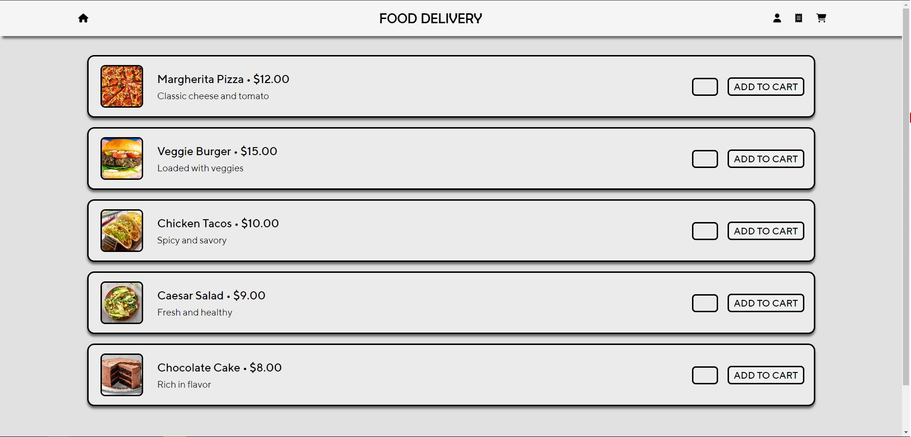
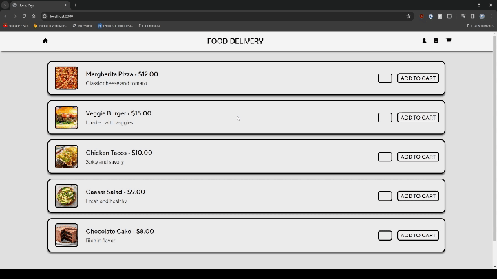
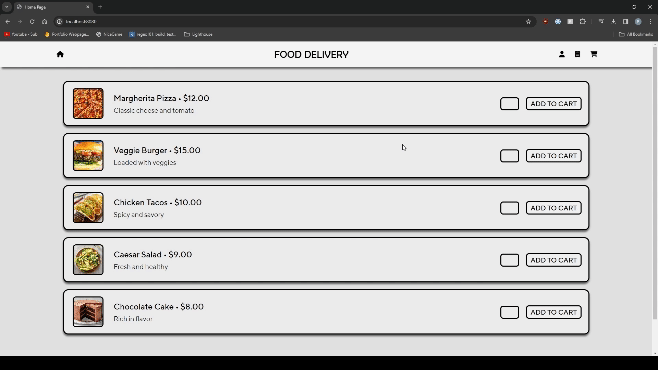

Food Delivery App
=========

## Getting Started

1. Create a fork and clone this repository.
2. Create the `.env` by using `.env.example` as a reference: `cp .env.example .env`
3. Update the .env file with your correct local information 
4. Install dependencies: `npm i`
5. Fix to binaries for sass: `npm rebuild node-sass`
6. Reset database: `npm run db:reset`
  - Check the db folder to see what gets created and seeded in the SDB
7. Run the server: `npm run local`
  - Note: nodemon is used, so you should not have to restart your server
8. Visit `http://localhost:8080/`

## Warnings & Tips

- Do not edit the `layout.css` file directly, it is auto-generated by `layout.scss`.
- Split routes into their own resource-based file names, as demonstrated with `users.js` and `widgets.js`.
- Split database schema (table definitions) and seeds (inserts) into separate files, one per table. See `db` folder for pre-populated examples. 
- Use helper functions to run your SQL queries and clean up any data coming back from the database. See `db/queries` for pre-populated examples.
- Use the `npm run db:reset` command each time there is a change to the database schema or seeds. 
  - It runs through each of the files, in order, and executes them against the database. 
  - Note: you will lose all newly created (test) data each time this is run, since the schema files will tend to `DROP` the tables and recreate them.

## Dependencies

- Node 15.14.x or above
- NPM 5.x or above
- PG 6.x
- chalk
- dotenv
- ejs
- express
- morgan
- pg
- sass
- twilio
- cookie-parser

## What To Expect

The Food Delivery App will open to a home page that displays all of the food items included in the 02_food_items.sql seeds.

The App will be logged into the Admin account by default (user_id: 1). This can be changed by clicking the user header and entering an alternate user. 

Users can add items to their cart using the ADD TO CART button and the number inputs. Then they can review their order in the cart page.

Once users submit their order the site admin will recieve a text notification that a new order has been made. The admin can navigate to the Orders page and enter how long the order will take to get ready.

Confirming the order will send an immediate message to the relevant user that their order will be ready in the specified amount of time. 

After the specified time has elapsed a second text message will be sent to the client to share that the order is ready.

## Credits
This project was made in collaboration with:
[Cody Lau](https://github.com/laucodx45)
[Spencer Lewis](https://github.com/spence914)
